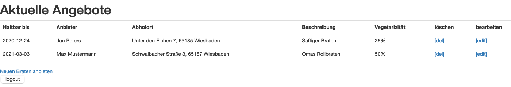

# Webanwendung Bratenbank - Backend
Hochschule RheinMain - Medieninformatik - Webbasierte Anwendungen - Sommersemester 2020 <br>
Projekt von **Sandra Kiefer** (bei Prof. Dr. Wolfgang Weitz)



## Installation und Startanweisungen
```sh
$ git clone https://github.com/sandrakiefer/BratenbankBackend.git
$ ./gradlew bootRun
```
Klonen Sie das Projekt in ein beliebiges Verzeichnis von Ihnen und starten Sie die Webnwendung mit Hilfe von Gradle.
Die Anwendung läuft dann zu Testzwecken auf ihrem Localhost unter Port 9090 (aufzurufen unter http://localhost:9090/).

### Übersicht der Pfade und deren Funktionalität
* **/benutzer** Registierung von Benutzern
* **/login** Login von Benutzer und Weiterleitung auf die Übersichtsseite der Angebote
* **/braten/angebot** Hier können neue Braten anleget,  bearbeitet oder gelöscht werden

## Projektbeschreibung
> In der aktuellen Situation ist gegenseitige Unterstützung besonders wichtig, unabhängig davon ist die Vermeidung von Verschwendung ein laufendes Anliegen. 
> Informationssysteme können dabei helfen.

Die Bratenbank ist eine Plattform, auf der Benutzer übrig gebliebenen Braten anbieten, und andere Benutzer danach suchen können. <br>
Dieses Repository beinhaltet das Backend, welches sich um die Datenhaltung in der Datenbanken kümmert, die Programmlogik bereitstellt und eine einfache REST-Schnitstelle zur Verfügung stellt (Verwendung im Frontend).
